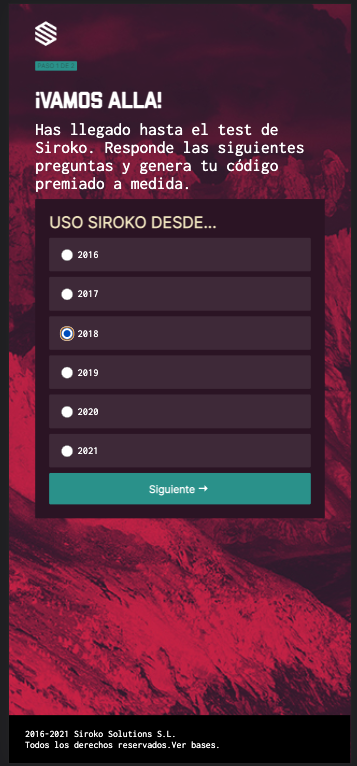
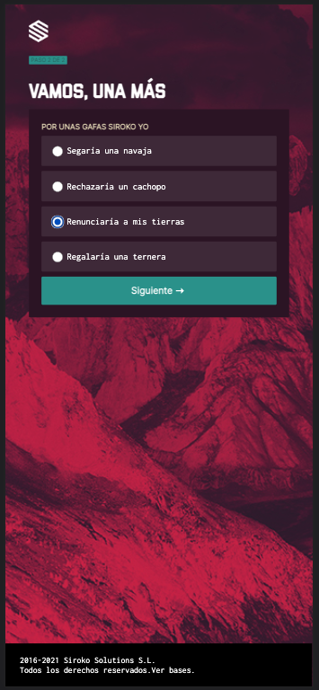
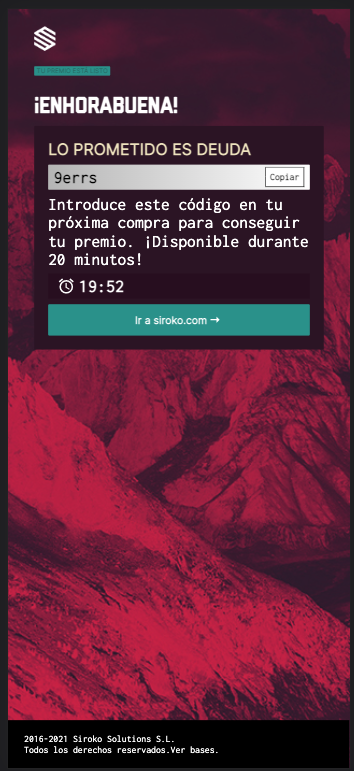
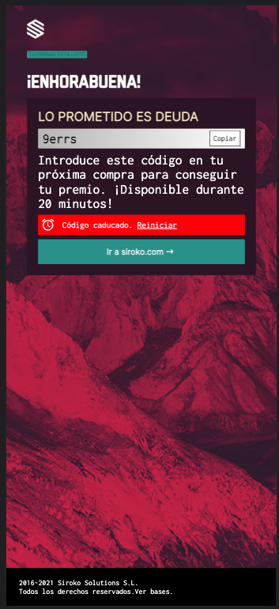
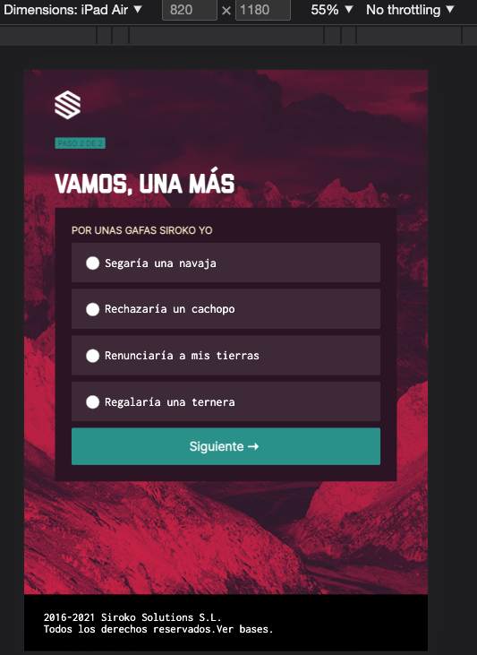
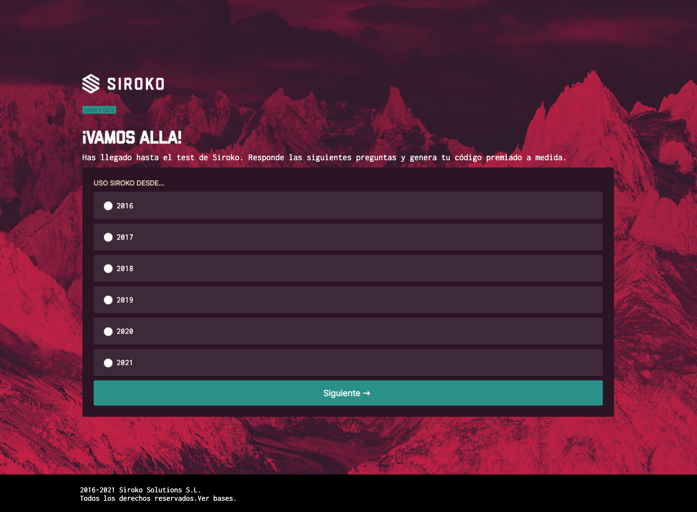

# Code challenge

This is the result of a technical test with the following requirements:

- Use Vanilla Js, HTML and CSS.
- It is optional to use Sass and Webpack.

To run the project you must execute the following commands:

- git clone (To clone from Github).
- npm install (to execute the installation of dependencies).
- npm start (to start the project).

For the layout a <a href="https://www.figma.com/file/KDuOCJHBVWXpv8Ix4rDsx8/SIROKO-Quiz" alt="Figma design guide">Figma</a> design is provided as a guide.

The challenge is to create a web application that displays a "two-step" form. In my case, I used:

- Webpack for the project configuration (v5.7).
- HTML5 for the layout.
- Sass as a style preprocessor (v1.54.9) applying the BEM methodology and with this property organization scheme: https://9elements.com/css-rule-order/
- Vanilla JS for the functionality

In the "first step" the user is shown a form with different years, from which he/she must choose an option and press the "Next" button to continue.

 In the "second step" he/she is shown another form with different sentences, from which he/she must choose an option and, again, click the "Next" button to continue. 
 
 

In both cases, the options are shown to the user with radio type inputs; the value checked by the user is stored in the local storage.

In the next screen, a code is displayed. The code is generated from the sum of the last two digits of the chosen year and the last 4 letters of the chosen phrase, eliminating the vowel "a" and spaces (if any). A button is also added to copy the generated code to the clipboard.

In this screen a counter is created that gives 20 minutes of time before the code expires. Once this time has elapsed, a message appears saying that the code has expired and a link to restart the whole process.

The project has different views depending on the device:

- mobile

- tablet

- web

Remarks:

The font sizes, widths, margins, etc, in the Figma design are not representative when creating the application. And adjustments should be made to make it as close as possible to the mockup.
